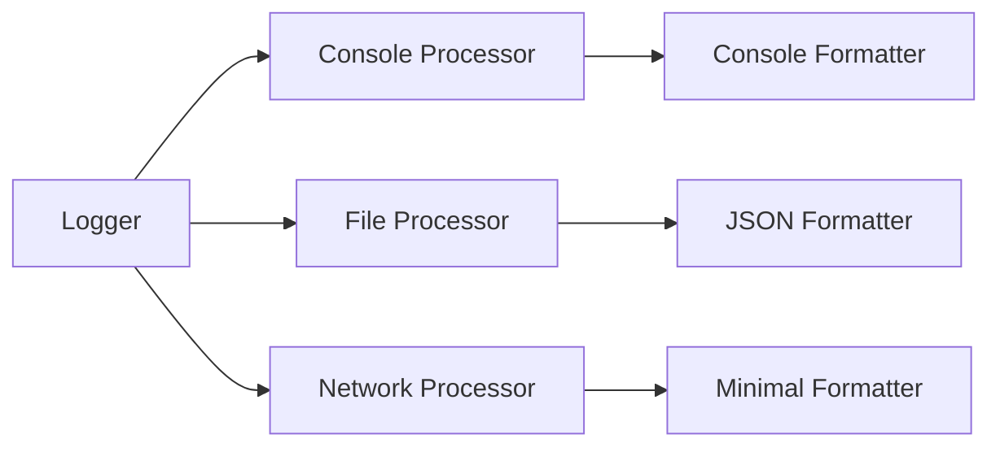

# GroveGames.Logger

A high-performance, zero-allocation logging library optimized for .NET 9 and Native AOT. Built for game development scenarios where performance is critical.

[](https://github.com/grovegs/Logger/actions/workflows/release.yml)
[](https://github.com/grovegs/Logger/actions/workflows/tests.yml)
[](https://github.com/grovegs/Logger/releases/latest)
[](https://www.nuget.org/packages/GroveGames.Logger)
[](https://opensource.org/licenses/MIT)

---

## Features

- **Zero-Allocation Logging**: Uses interpolated string handlers and `Span<char>` to eliminate heap allocations
- **Native AOT Compatible**: Fully supports ahead-of-time compilation for maximum performance
- **Asynchronous File Writing**: Non-blocking log writes using channels and background processing
- **Automatic File Rotation**: Manages log files with configurable limits and automatic cleanup
- **Flexible Log Processing**: Extensible processor system for custom log handling
- **Custom Formatting**: Full control over log output format via `ILogFormatter` interface
- **Godot Engine Integration**: Available as a Godot addon with project settings integration
- **Factory Pattern**: Simple logger creation via factory methods for easy integration

## Installation

### Core Library

Add the library to your .NET project via NuGet:

```bash
dotnet add package GroveGames.Logger
```

### Godot Integration

For Godot Engine integration, you need both the NuGet package and the Godot addon:

1. **Install the NuGet package** in your Godot project:

   ```bash
   dotnet add package GroveGames.Logger.Godot
   ```

2. **Download the Godot addon** from the [latest release](https://github.com/grovegs/Logger/releases/latest):

   - Download `logger-{version}-godot-addon.zip` (e.g., `logger-0.1.4-godot-addon.zip`)
   - Extract the contents to your project's `addons` folder
   - Your project structure should look like:

     ```text
     res://
     ├── addons/
     │   └── grovegames.logger/
     │       ├── plugin.cfg
     │       └── ... (other addon files)
     └── ... (your project files)
     ```

3. **Enable the addon** in Project Settings → Plugins

The addon provides integration with Godot's project settings and specialized formatters for the editor console.

---

## Quick Start

The library uses a factory pattern for logger creation, providing a clean and extensible API. This approach allows for easy configuration while keeping the logger instances immutable.

### Basic Console Logging

```csharp
using GroveGames.Logger;

// Create a logger using the factory pattern
var logger = LoggerFactory.CreateLogger(builder =>
{
    builder.SetMinimumLevel(LogLevel.Information)
           .AddLogProcessor(new ConsoleLogProcessor(new ConsoleLogFormatter()));
});

// Log messages with zero allocations
logger.LogInformation("App", $"Application started at {DateTime.UtcNow}");
logger.LogWarning("App", $"Memory usage: {GC.GetTotalMemory(false) / 1024 / 1024}MB");
logger.LogError("App", $"Failed to load configuration");
```

### File Logging

```csharp
// Create a file logger with automatic rotation and custom formatting
var logger = LoggerFactory.CreateLogger(builder =>
{
    var logFileFactory = new LogFileFactory(
        root: "logs",
        folderName: "app",
        maxFileCount: 10,
        bufferSize: 8192
    );

    var fileStream = logFileFactory.CreateFile();
    var streamWriter = new StreamWriter(fileStream, bufferSize: 8192, channelCapacity: 1000);
    var fileProcessor = new FileLogProcessor(streamWriter, new FileLogFormatter());

    builder.SetMinimumLevel(LogLevel.Debug)
           .AddLogProcessor(fileProcessor);
});
```

---

## Godot Addon Integration

The library provides a Godot addon for seamless integration with the Godot Engine. The addon must be downloaded from GitHub releases and installed in your project's addons folder.

### Setting Up Godot Logger

After installing both the NuGet package and the addon:

```csharp
using GroveGames.Logger;
using Godot;

public partial class Main : Node
{
    private Logger _logger;

    public override void _Ready()
    {
        // Initialize addon settings in project settings
        GodotSettings.CreateIfNotExist();

        // Create logger using Godot-specific factory
        _logger = GodotLoggerFactory.CreateLogger(builder =>
        {
            // Console output with Godot-specific formatting
            builder.AddLogProcessor(new GodotConsoleLogProcessor(
                text => GD.Print(text),
                new GodotConsoleLogFormatter()
            ));

            // File output with standard formatting
            var fileStream = CreateLogFileStream();
            var streamWriter = new StreamWriter(fileStream, 8192, 1000);
            builder.AddLogProcessor(new FileLogProcessor(
                streamWriter,
                new FileLogFormatter()
            ));
        });

        _logger.LogInformation("Game", $"Godot {Engine.GetVersionInfo()} initialized");
    }
}
```

### Godot Console Formatter

The `GodotConsoleLogFormatter` provides rich formatting for the Godot editor console:

- Warning messages are highlighted with yellow color and ⚠️ emoji
- Timestamps in HH:mm:ss format for easy debugging
- Clean tag presentation with brackets

Example output:

```text
12:34:56 [Player] Health decreased to 50
⚠️ 12:34:57 [Enemy] Low performance detected: 45 FPS
12:34:58 [System] Checkpoint saved
```

### Godot Addon Benefits

Using the logger as a Godot addon provides several advantages:

1. **Project Settings Integration**: Configure logging directly from Godot's UI without code changes
2. **Editor Console Support**: Rich formatting designed for Godot's output panel
3. **Automatic Initialization**: Settings are loaded from project configuration at startup
4. **Cross-Platform**: Works seamlessly across all Godot-supported platforms

### Project Settings Configuration

The addon automatically adds the following settings to your Godot project settings under `grove_games/logger/`:

| Setting                 | Type       | Default       | Description                               |
| ----------------------- | ---------- | ------------- | ----------------------------------------- |
| `min_log_level`         | `LogLevel` | `Information` | Minimum level for log output              |
| `max_file_count`        | `int`      | `10`          | Maximum number of log files to retain     |
| `file_folder_name`      | `string`   | `"logs"`      | Folder name for log files                 |
| `file_buffer_size`      | `int`      | `8192`        | Buffer size in bytes for file operations  |
| `file_channel_capacity` | `int`      | `1000`        | Channel capacity for async log processing |

These settings can be modified directly in the Godot Project Settings UI under the "Grove Games > Logger" section.

---

## Advanced Usage

### Custom Log Formatters

Formatters control how log entries are rendered. Implement `ILogFormatter` to create custom formats:

```csharp
public sealed class JsonLogFormatter : ILogFormatter
{
    public int GetBufferSize(LogLevel level, ReadOnlySpan<char> tag, ReadOnlySpan<char> message)
    {
        // Calculate required buffer size for JSON format
        // Include space for timestamp, level, tag, message, and JSON structure
        return 100 + tag.Length + message.Length;
    }

    public void Format(Span<char> buffer, LogLevel level, ReadOnlySpan<char> tag, ReadOnlySpan<char> message)
    {
        var timestamp = DateTime.UtcNow;
        var position = 0;

        // Build JSON manually for zero allocations
        "{\"time\":\"".AsSpan().CopyTo(buffer[position..]);
        position += 10;

        timestamp.TryFormat(buffer[position..], out var written, "O");
        position += written;

        "\",\"level\":\"".AsSpan().CopyTo(buffer[position..]);
        position += 12;

        level.ToString().AsSpan().CopyTo(buffer[position..]);
        position += level.ToString().Length;

        "\",\"tag\":\"".AsSpan().CopyTo(buffer[position..]);
        position += 10;

        tag.CopyTo(buffer[position..]);
        position += tag.Length;

        "\",\"message\":\"".AsSpan().CopyTo(buffer[position..]);
        position += 14;

        message.CopyTo(buffer[position..]);
        position += message.Length;

        "\"}".AsSpan().CopyTo(buffer[position..]);
    }
}

// Use the custom formatter with a processor
var logger = LoggerFactory.CreateLogger(builder =>
{
    builder.AddLogProcessor(new ConsoleLogProcessor(new JsonLogFormatter()))
           .AddLogProcessor(new FileLogProcessor(streamWriter, new JsonLogFormatter()));
});
```

### Minimal Formatter Example

For scenarios where you need minimal formatting:

```csharp
public sealed class MinimalLogFormatter : ILogFormatter
{
    public int GetBufferSize(LogLevel level, ReadOnlySpan<char> tag, ReadOnlySpan<char> message)
    {
        // [LEVEL] Tag: Message
        return level.ToString().Length + tag.Length + message.Length + 7;
    }

    public void Format(Span<char> buffer, LogLevel level, ReadOnlySpan<char> tag, ReadOnlySpan<char> message)
    {
        var position = 0;

        buffer[position++] = '[';
        level.ToString().AsSpan().CopyTo(buffer[position..]);
        position += level.ToString().Length;
        buffer[position++] = ']';
        buffer[position++] = ' ';

        tag.CopyTo(buffer[position..]);
        position += tag.Length;

        buffer[position++] = ':';
        buffer[position++] = ' ';

        message.CopyTo(buffer[position..]);
    }
}
```

### Custom Log Processors

Processors handle formatted log entries. Combine them with formatters for complete control:

```csharp
public sealed class NetworkLogProcessor : ILogProcessor
{
    private readonly INetworkClient _client;
    private readonly ILogFormatter _formatter;

    public NetworkLogProcessor(INetworkClient client, ILogFormatter formatter)
    {
        _client = client;
        _formatter = formatter;
    }

    public void ProcessLog(LogLevel level, ReadOnlySpan<char> tag, ReadOnlySpan<char> message)
    {
        // Calculate buffer size and format the log
        var bufferSize = _formatter.GetBufferSize(level, tag, message);
        Span<char> buffer = stackalloc char[bufferSize];
        _formatter.Format(buffer, level, tag, message);

        // Send formatted log over network
        _client.SendAsync(buffer);
    }
}

// Use in your application
var logger = LoggerFactory.CreateLogger(builder =>
{
    builder.SetMinimumLevel(LogLevel.Warning)
           .AddLogProcessor(new NetworkLogProcessor(networkClient, new JsonLogFormatter()));
});
```

### Multiple Processors with Different Formatters

You can use different formatters for different outputs:

```csharp
var logger = LoggerFactory.CreateLogger(builder =>
{
    // Human-readable format for console
    builder.AddLogProcessor(new ConsoleLogProcessor(new GodotConsoleLogFormatter()));

    // Structured format for files
    var fileStream = logFileFactory.CreateFile();
    var streamWriter = new StreamWriter(fileStream, 8192, 1000);
    builder.AddLogProcessor(new FileLogProcessor(streamWriter, new JsonLogFormatter()));

    // Minimal format for network transmission
    builder.AddLogProcessor(new NetworkLogProcessor(client, new MinimalLogFormatter()));
});
```

### Creating Your Own Factory

For common logging scenarios, create your own factory methods:

```csharp
public static class MyLoggerFactory
{
    public static Logger CreateConsoleLogger(LogLevel minLevel = LogLevel.Information)
    {
        return LoggerFactory.CreateLogger(builder =>
        {
            builder.SetMinimumLevel(minLevel)
                   .AddLogProcessor(new ConsoleLogProcessor(new ConsoleLogFormatter()));
        });
    }

    public static Logger CreateFileLogger(string logPath, LogLevel minLevel = LogLevel.Debug)
    {
        return LoggerFactory.CreateLogger(builder =>
        {
            var logFileFactory = new LogFileFactory(
                root: Path.GetDirectoryName(logPath),
                folderName: Path.GetFileName(logPath),
                maxFileCount: 10,
                bufferSize: 8192
            );

            var fileStream = logFileFactory.CreateFile();
            var streamWriter = new StreamWriter(fileStream, 8192, 1000);

            builder.SetMinimumLevel(minLevel)
                   .AddLogProcessor(new FileLogProcessor(streamWriter, new FileLogFormatter()));
        });
    }

    public static Logger CreateDevelopmentLogger()
    {
        return LoggerFactory.CreateLogger(builder =>
        {
            builder.SetMinimumLevel(LogLevel.Debug)
                   .AddLogProcessor(new ConsoleLogProcessor(new ConsoleLogFormatter()))
                   .AddLogProcessor(new FileLogProcessor(CreateFileWriter(), new JsonLogFormatter()));
        });
    }
}

// Usage
var logger = MyLoggerFactory.CreateDevelopmentLogger();
logger.LogDebug("App", $"Development mode active");
```

### Performance-Critical Scenarios

The logger uses interpolated string handlers that only allocate when the log level is active:

```csharp
// This allocates nothing if Debug logging is disabled
logger.LogDebug("Performance", $"Frame time: {frameTime:F2}ms, FPS: {1000f/frameTime:F0}");

// Log levels are checked before string interpolation occurs
for (int i = 0; i < 1000000; i++)
{
    // Zero overhead when logging is disabled
    logger.LogDebug("Loop", $"Iteration {i} of {1000000}");
}
```

---

## Architecture

### Core Components

- **`ILogger`**: Core logging interface with minimal API surface
- **`Logger`**: Main implementation with processor management
- **`LoggerFactory`**: Primary entry point for creating loggers with builder configuration
- **`LoggerBuilder`**: Fluent API for logger configuration (used via factory)
- **`ILogProcessor`**: Interface for processing log entries
- **`ILogFormatter`**: Interface for controlling log entry formatting
- **`StreamWriter`**: High-performance async file writer with batching
- **`LogFileFactory`**: Manages log file creation and rotation

### Godot Addon Features

When using the Godot addon, you get additional components:

- **`GodotLoggerFactory`**: Factory that reads configuration from Godot project settings
- **`GodotConsoleLogFormatter`**: Rich formatting for Godot's editor console
- **`GodotSettings`**: Integration with Godot's project settings system
- **`GodotConsoleLogProcessor`**: Processor optimized for Godot's output methods

### Formatter and Processor Relationship

Formatters and processors work together to provide flexible logging:

1. **Formatters** define how log data is serialized (JSON, plain text, CSV, etc.)
2. **Processors** define where formatted logs are sent (console, file, network, etc.)
3. Each processor can have its own formatter for destination-specific formatting



### Performance Optimizations

1. **Zero-Allocation String Handling**: Uses `Span<char>` and stackalloc throughout
2. **Interpolated String Handlers**: Compile-time optimization for string formatting
3. **Channel-Based Async I/O**: Lock-free producer-consumer pattern for file writes
4. **Batched Writing**: Reduces I/O operations by batching multiple log entries
5. **Native AOT**: Full compatibility with ahead-of-time compilation

---

## Testing

The library includes comprehensive unit tests covering:

- Core logging functionality
- File rotation and management
- Async write operations
- Thread safety
- Performance characteristics

Run tests:

```bash
dotnet test
```

---

## Contributing

Contributions are welcome! Please:

1. Fork the repository
2. Create a feature branch
3. Write tests for new functionality
4. Submit a pull request

---

## License

This project is licensed under the MIT License - see the [LICENSE](LICENSE) file for details.
